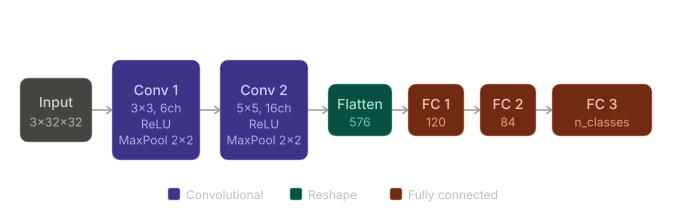
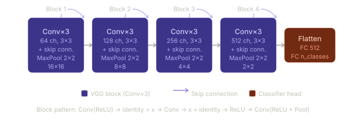
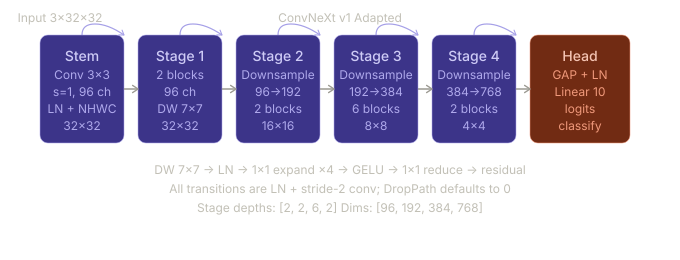
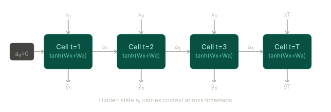
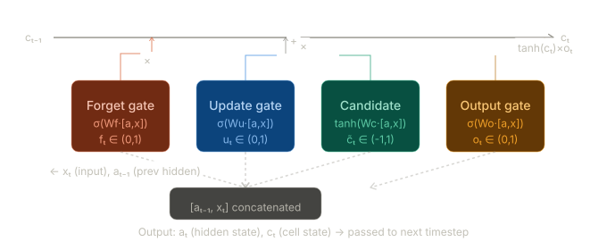
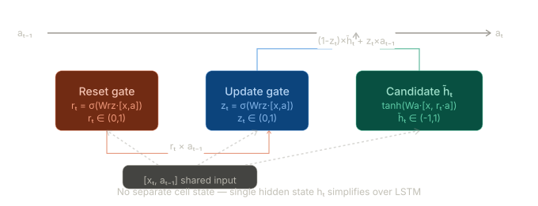

# Deep Learning Architecture Experiments

A collection of deep learning architectures implemented from scratch in PyTorch.

---

## Table of Contents

1. [LeNet-5](#lenet-5)
2. [VGG–ResNet Hybrid (PinteeCNN)](#vgg-resnet-hybrid-pinteecnn)
3. [ConvNeXt v1](#convnext-v1)
4. [Vanilla RNN](#vanilla-rnn)
5. [LSTM](#lstm-long-short-term-memory)
6. [GRU](#gru-gated-recurrent-unit)

---

## LeNet-5

**File:** `LeNet-5.py`  
**Class:** `Lenet`

### Overview
A modernized implementation of the classic LeNet-5 convolutional architecture, originally designed for handwritten digit recognition. This version adapts the original design for 3-channel (RGB) inputs and uses ReLU activations instead of the original sigmoid/tanh.

### Architecture diagram



```
Input        Conv 1           Conv 2        Flatten    FC 1   FC 2     FC 3
3×32×32  →  3×3, 6ch     →  5×5, 16ch  →   576    →  120  →  84  →  n_classes
             ReLU              ReLU
             MaxPool 2×2       MaxPool 2×2
(B,3,32,32) (B,6,16,16)      (B,16,6,6)   (B,576)
```

### Layer table

| Layer | Type | Input Shape | Output Shape | Details |
|-------|------|-------------|--------------|---------|
| conv_layer1 | Conv2d + ReLU + MaxPool | (B, 3, 32, 32) | (B, 6, 16, 16) | 3×3 kernel, same padding, pool 2×2 |
| conv_layer2 | Conv2d + ReLU + MaxPool | (B, 6, 16, 16) | (B, 16, 6, 6) | 5×5 kernel, no padding, pool 2×2 |
| Flatten | — | (B, 16, 6, 6) | (B, 576) | — |
| fc_layer1 | Linear + ReLU | (B, 576) | (B, 120) | — |
| fc_layer2 | Linear + ReLU | (B, 120) | (B, 84) | — |
| fc_layer3 | Linear | (B, 84) | (B, n_classes) | Logits output |

### Key design choices
- Uses **ReLU** activations (vs. original sigmoid) for better gradient flow
- **Same padding** in the first conv layer to preserve spatial dimensions before pooling
- Default output: **10 classes** (configurable via `n_classes`)

---

## VGG–ResNet Hybrid (PinteeCNN)

**File:** `VGG_ResNet_Hybrid.py`  
**Class:** `PinteeCNN`

### Overview
A custom hybrid architecture combining VGG-style stacked convolutional blocks with ResNet-style skip connections (residual connections). Each block follows the pattern: `Conv → identity shortcut → ReLU → Conv+Pool`, doubling channels while halving spatial dimensions at each stage.

### Architecture diagram



```
Block 1          Block 2          Block 3          Block 4
3→64 ch          64→128 ch        128→256 ch       256→512 ch
32×32→16×16      16×16→8×8        8×8→4×4          4×4→2×2
Conv×3           Conv×3           Conv×3           Conv×3
↑ skip conn.     ↑ skip conn.     ↑ skip conn.     ↑ skip conn.
                                                       ↓
                                               Flatten → FC(512) → FC(n_classes)
```

### Block pattern (per block)
```
Conv (ReLU)  →  identity = x
Conv         →  x = x + identity  →  ReLU
Conv (ReLU + MaxPool)
```

### Block table

| Block | Channels | Spatial (in → out) | Skip Connection |
|-------|----------|--------------------|-----------------|
| Block 1 | 3 → 64 | 32×32 → 16×16 | ✅ on layer 2 |
| Block 2 | 64 → 128 | 16×16 → 8×8 | ✅ on layer 5 |
| Block 3 | 128 → 256 | 8×8 → 4×4 | ✅ on layer 8 |
| Block 4 | 256 → 512 | 4×4 → 2×2 | ✅ on layer 11 |

**Classifier head:** Flatten → Linear(2048, 512) + ReLU → Linear(512, n_classes)

### Key design choices
- **VGG-style depth**: 3 conv layers per block, all with 3×3 kernels and same padding
- **ResNet-style shortcuts**: skip connections added after the second conv in each block to mitigate vanishing gradients
- Channel dimensions double at each block (64 → 128 → 256 → 512)
- Default output: **10 classes** (configurable)

---

## ConvNeXt v1

**File:** `ConvNeXt_v1_Adapted.py`  
**Class:** `ConvNeXt_V1`

### Overview
A CIFAR-10 adapted ConvNeXt v1 implementation. Compared with the original ImageNet design, this version starts with a stride-1 stem so the model preserves more spatial detail on 32×32 inputs. It uses depthwise convolutions, LayerNorm, GELU activations, residual blocks, and a global average pooling classifier head.

### Architecture diagram



```
Input → StemBlock → Stage 1 → Downsample → Stage 2 → Downsample → Stage 3 → Downsample → Stage 4 → GAP → Linear
    3×3 conv   [3 blocks]               [3 blocks]            [9 blocks]             [3 blocks]
```

### Stage table

| Stage | Input Channels | Output Channels | Spatial Change | Repeated Blocks |
|-------|----------------|-----------------|----------------|-----------------|
| StemBlock | 3 | 96 | 32×32 → 32×32 | 1 |
| Stage 1 | 96 | 96 | 32×32 → 32×32 | 3 ConvNeXt blocks |
| Downsample 1 | 96 | 192 | 32×32 → 16×16 | 1 |
| Stage 2 | 192 | 192 | 16×16 → 16×16 | 3 ConvNeXt blocks |
| Downsample 2 | 192 | 384 | 16×16 → 8×8 | 1 |
| Stage 3 | 384 | 384 | 8×8 → 8×8 | 9 ConvNeXt blocks |
| Downsample 3 | 384 | 768 | 8×8 → 4×4 | 1 |
| Stage 4 | 768 | 768 | 4×4 → 4×4 | 3 ConvNeXt blocks |
| GlobalAveragePoolingHead | 768 | n_classes | 4×4 → 1×1 | 1 |

### Key design choices
- Uses a **3×3 stem with stride 1** instead of the original ConvNeXt stride-4 stem to suit CIFAR-10 resolution
- Applies **depthwise 7×7 convolutions** inside each block for efficient spatial mixing
- Uses **LayerNorm + GELU + pointwise expansion/reduction** as the core block pattern
- Adds **stochastic depth** through DropPath and optional **layer scale** for training stability
- Default output: **10 classes**

---

## Vanilla RNN

**File:** `Vanilla_RNN.py`  
**Classes:** `PureVanillaRNNCell`, `VanillaRNNCell`, `VanillaRNN`

### Overview
A from-scratch implementation of a Vanilla (Elman) RNN, provided in two cell variants — one with **separate weight matrices** for input and hidden state, and one using a **single combined linear layer** — plus a full sequence module.

### Architecture diagram (unrolled)



```
a₀=0 ──→ [Cell t=1] ──a₁──→ [Cell t=2] ──a₂──→ [Cell t=3] ──a₃──→ [Cell t=T]
              ↑                   ↑                   ↑                   ↑
              x₁                  x₂                  x₃                  xT
              ↓                   ↓                   ↓                   ↓
              ŷ₁                  ŷ₂                  ŷ₃                  ŷT

Each cell: aₜ = tanh(W·[xₜ, aₜ₋₁]),   ŷₜ = softmax(Wy·aₜ)
```

### Cell variants

#### `PureVanillaRNNCell` — Explicit weights
Maintains separate linear projections for input and hidden state, mirroring the mathematical formulation:

```
a_t = tanh(W_x · x_t + W_a · a_prev)
ŷ_t = softmax(W_y · a_t)
```

#### `VanillaRNNCell` — Combined weights (efficient)
Concatenates `[x_t, a_prev]` and passes through a single linear layer — computationally equivalent but more efficient:

```
a_t = tanh(W · [x_t, a_prev])
ŷ_t = softmax(W_y · a_t)
```

### `VanillaRNN` — Full sequence module

| Parameter | Description |
|-----------|-------------|
| `input_size` | Feature dimension of each time step |
| `hidden_size` | Dimension of the hidden state |
| `output_size` | Output dimension (default: 1) |

**Forward pass:** Iterates over `seq_len` time steps, initializing `a_0 = zeros`. Returns `(final_hidden_state, all_predictions)`.

### Key design choices
- Two implementations provided to illustrate **mathematical clarity vs. implementation efficiency**
- Softmax applied at each timestep — suited for sequence-to-sequence classification tasks

---

## LSTM (Long Short-Term Memory)

**File:** `LSTM.py`  
**Classes:** `PurePinteeLSTMCell`, `PinteeLSTMCell`, `PinteeLSTM`

### Overview
A from-scratch LSTM implementation with two cell variants: one using **four separate gate matrices** for interpretability, and a fused version using a **single matrix for all gates** for efficiency. Both implement the full LSTM gating mechanism with a cell state `c_t` and hidden state `a_t`.

### Architecture diagram (single cell)



```
cₜ₋₁ ───────×────────────────────+──────────────────────────→ cₜ
             ↑ fₜ                 ↑ uₜ × c̃ₜ                       ↓
         [Forget]             [Update] [Candidate]             tanh(cₜ)
         σ(Wf·z)              σ(Wu·z)  tanh(Wc·z)                  ×
                                                              [Output gate]
                                                              σ(Wo·z) → aₜ

z = [aₜ₋₁, xₜ]   (concatenated input to all four gates)
```

### Gate equations

```
f_t = σ(W_f · [a_prev, x_t])    # Forget gate
u_t = σ(W_u · [a_prev, x_t])    # Update gate
c̃_t = tanh(W_C · [a_prev, x_t]) # Candidate cell state
c_t = f_t * c_prev + u_t * c̃_t  # New cell state
o_t = σ(W_o · [a_prev, x_t])    # Output gate
a_t = o_t * tanh(c_t)            # New hidden state
```

### Cell variants

#### `PurePinteeLSTMCell` — Separate gate matrices
Four independent `nn.Linear` layers (`W_f`, `W_u`, `W_C`, `W_o`), making each gate's weights explicit and independently inspectable.

#### `PinteeLSTMCell` — Fused gate matrix (efficient)
A single `nn.Linear` projecting to `4 * hidden_size`, then chunked into 4 gates. This is the standard PyTorch-style implementation.

### `PinteeLSTM` — Full sequence module

| Parameter | Description |
|-----------|-------------|
| `input_size` | Feature dimension per time step |
| `hidden_size` | LSTM hidden/cell state dimension |

**Forward pass:** Initializes both `a_0` and `c_0` as zeros. Returns `(all_hidden_states, (final_a_t, final_c_t))`.

### Key design choices
- Both variants implement identical logic — the pair demonstrates **readable math vs. efficient fused computation**
- Dual state tracking (`a_t` and `c_t`) is the core advantage over Vanilla RNN — the cell state acts as long-term memory

---

## GRU (Gated Recurrent Unit)

**File:** `GRU.py`  
**Classes:** `PinteeGRUCell`, `PinteeGRU`

### Overview
A from-scratch GRU implementation. GRU simplifies the LSTM by merging the forget and update gates into a single **update gate** and introducing a **reset gate**, eliminating the separate cell state. This results in fewer parameters while retaining strong sequence modeling capability.

### Architecture diagram (single cell)



```
aₜ₋₁ ──────────────────────────────────────────────→ aₜ
         ↗ zₜ (update)                    ↑
[xₜ, aₜ₋₁]                   (1-zₜ)×h̃ₜ + zₜ×aₜ₋₁
         ↘ rₜ (reset)               ↑
                     tanh(Wa·[xₜ, rₜ×aₜ₋₁]) = h̃ₜ
```

### Gate equations

```
r_t = σ(W_rz · [x_t, a_prev])[:hidden]    # Reset gate
z_t = σ(W_rz · [x_t, a_prev])[hidden:]    # Update gate
h̃_t = tanh(W_a · [x_t, r_t * a_prev])     # Candidate hidden state
h_t = (1 - z_t) * h̃_t + z_t * a_prev     # New hidden state
```

### `PinteeGRUCell`

Uses two linear layers:
- `linear_rz`: projects `[x_t, a_prev]` → `2 * hidden_size`, then chunked into reset and update gates
- `linear_a`: projects `[x_t, r_t * a_prev]` → `hidden_size` for the candidate state

### `PinteeGRU` — Full sequence module

| Parameter | Description |
|-----------|-------------|
| `input_size` | Feature dimension per time step |
| `hidden_size` | GRU hidden state dimension |

**Forward pass:** Initializes `h_0 = zeros`. Returns `(all_hidden_states, final_h_t)`.

### Key design choices
- **No separate cell state** — single hidden state `h_t` compared to LSTM's `(a_t, c_t)` pair
- Reset and update gates computed in **one fused linear call** (`linear_rz`) for efficiency
- Output format mirrors PyTorch's native GRU interface

---

## Summary Comparison

| Architecture | Type | Input | Key Feature | Parameters (relative) |
|---|---|---|---|---|
| LeNet-5 | CNN | Images (3×32×32) | Classic conv + FC pipeline | Low |
| VGG–ResNet Hybrid | CNN | Images (3×32×32) | VGG blocks + residual shortcuts | High |
| ConvNeXt v1 | CNN | Images (3×32×32) | Modern conv blocks with depthwise conv + LayerNorm | Very High |
| Vanilla RNN | RNN | Sequences | Single hidden state, no gating | Very Low |
| LSTM | RNN | Sequences | Cell state + 4-gate memory control | High |
| GRU | RNN | Sequences | 2-gate simplified LSTM variant | Medium |

### RNN family gating comparison

```
Vanilla RNN:   xₜ, aₜ₋₁ ──→ tanh ──→ aₜ               (no gates)

GRU:           xₜ, aₜ₋₁ ──→ reset gate rₜ              (2 gates, 1 state)
                          ──→ update gate zₜ ──→ hₜ

LSTM:          xₜ, aₜ₋₁ ──→ forget gate fₜ             (4 gates, 2 states)
                          ──→ update gate uₜ
                          ──→ output gate oₜ ──→ aₜ, cₜ
                          ──→ candidate  c̃ₜ
```